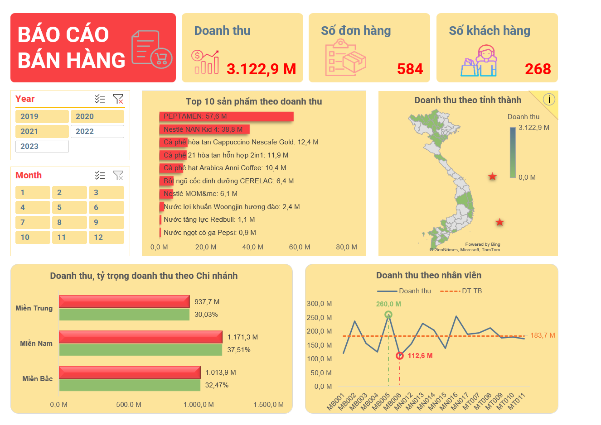

# 📊 Excel Sales Dashboard

## 👋 Giới thiệu
Dashboard được thiết kế bằng Excel nhằm phân tích dữ liệu bán hàng, số đơn hàng và hành vi khách hàng theo năm, tháng, khu vực và nhân viên.

## 🎯 Mục tiêu
Giúp nhà quản lý có cái nhìn trực quan về hiệu suất kinh doanh, top sản phẩm bán chạy và phân bố doanh thu theo khu vực/nhân viên.

## 🛠️ Kỹ năng sử dụng
- Excel PivotTable
- Slicer (lọc dữ liệu tương tác)
- Conditional Formatting
- Charts (bar, line, map)

## 🖼️ Dashboard Preview

## 📁 File đính kèm
- `Pham Phuong Hoa - Bai thu hoach.xlsx`: File Excel chứa dashboard tương tác
